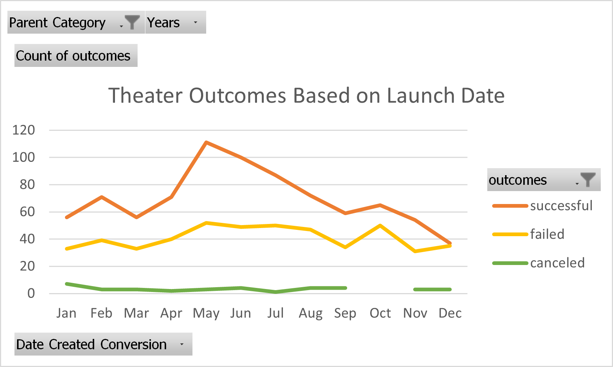
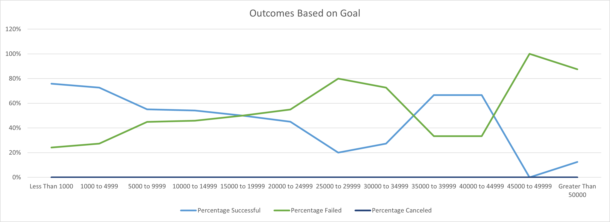

# An Analysis of Kickstarter Campaigns
Performing analysis on Kickstarter data to uncover trends
# Kickstarting with Excel

## Overview of Project
>Data visualization in Excel of the outcomes of Kickstarter fundraising for various theater productions. 
### Purpose
>Analyze relationship between theater campaign outcomes and their respective launch dates and funding goals.
## Analysis and Challenges

### Analysis of Outcomes Based on Launch Date
>Visualization of the total number of successful, failed, and canceled theater campaigns based on the month the campaign began. 
 
### Analysis of Outcomes Based on Goals
>Visualization of the percentage of successful, failed, and canceled campaigns based on the amount of the funding goal. 
 
### Challenges and Difficulties Encountered
>Formulas occassionally returned #DIV/0 errors when referencing a field with either no data available or with a value of 0 requiring the addition of an IFERROR formula. 
## Results

- What are two conclusions you can draw about the Outcomes based on Launch Date?
>Fundraising campaigns launched in May, June, and July had noticiably higher success rates with May being the peak. For campaigns launched in December, there is nearly equal chance of success or failure. 
- What can you conclude about the Outcomes based on Goals?
>Success rates of fundraising campaigns tend to be higher if the goal is lower with a noticiable decrease in success odds with a goal amount greater than or equal to $5000. 
- What are some limitations of this dataset?
>Attempting to visualize data from multiple countries could present multiple issues for this particular set of data. Currency exchange rates make the inclusion or comparison of goal amounts from countries with different currency types less useful. The launch dates of a campaign coincide with different seasons depending on the country as well which could affect fundraising. For example an outdoor theater attempting to raise funds during harsh weather, either extreme heat or cold, may be less successful as patrons could have less favorable reactions to the prospect and be less likely to donate. 
- What are some other possible tables and/or graphs that we could create?
>It may be beneficial to create a graph comparing the length of a campaign to the outcome or goal. Charting the success of campaigns as it compares to the number of backers and also comparing the number of backers to the launch date to check for correlation between overall backer response to a campaign and what times of year the majority of backers are most interested in funding theater campaigns. 
